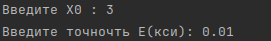
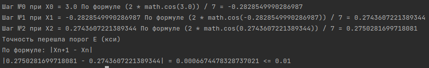

Computational_Mathematics
---
---

[Проект выложен на pypi.org](https://pypi.org/project/ComputMath/)
установить с официального сайта можно следующей командой :

```
pip install ComputMath
```

---

Модуль содержит методы решения различных задач по 
вычислительной математике. Рассчитан на 2-3 курс
по предмету "Вычислительная математика"

1. Численные методы решения нелинейных уравнений ( нахождения корней уравнения )
   
   - [Метод половинного деления](ComputMath/root/half_division.py)
   - [Метод простой итерации](ComputMath/root/simple_iteration.py)

2. Численные методы решения дифференциальных уравнений.
   
   - [Метод Эйлера](ComputMath/differential/euler.py)
   - [Рунге-Кутта 4-го порядка](ComputMath/differential/runge_kutt.py)
   
3. Численные методы вычисления определенных интегралов.
   
   - [Методом Симпсона](ComputMath/integral/simpson.py)
   - [Методом левых прямоугольников](ComputMath/integral/left_rectangles.py)

---

Как это использовать, импортируем пакет по его имени `ComputMath`
создайте свою функцию, которую вам нужно подсчитать, и передайте 
ее в нужный вам численный метод:

```python
import ComputMath

def function(x):
    """Функция для вычислений"""
    return (2 * math.cos(x)) / 7

ComputMath.simple_iteration(function)
```
---

Вводим параметры:



Получаем результат:


